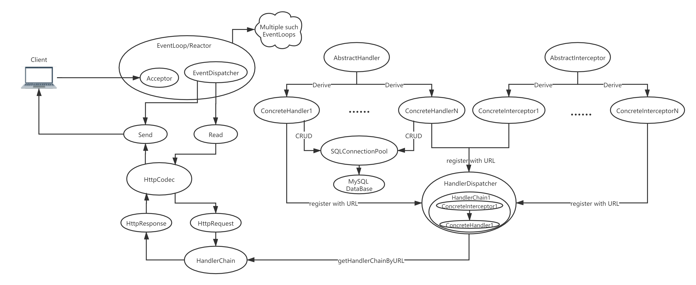
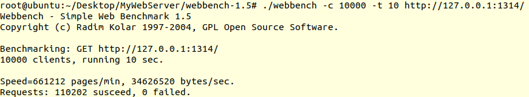

## MyWebServer
* 利用IO复用技术epoll、非阻塞socket、多Reactor事件处理模式实现网络库
* 每个线程运行一个EventLoop，每个EventLoop都是一个基于epoll的Reactor模型，都能接受socket连接，并负责其所接受的socket的事件监听与分发，使用Linux 内核3.9版本后提供的SO_REUSEPORT选项，防止Acceptor的“惊群”问题
* 封装标准库容器vector构建缓冲区类，实现读写缓冲区自动增长
* 利用正则表达式与有限状态机解析HTTP请求报文(GET和POST)，实现处理客户对静态资源的请求
* 基于红黑树(std::set)实现定时器队列，基于LRU算法构建以最后活跃时间排序的Tcp连接链表，在定时器队列中以2s为周期检查Tcp连接链表，关闭超时(默认30s)无响应的非活跃Tcp连接
* 实现HttpCodec类，对底层TcpConnection接收的数据进行Http报文解析、封装成HttpRequest和HttpResponse，并根据请求的URL通过HandlerDispatcher转发到对应的handler中处理，处理完毕，HttpCodec将处理结果封装成Http报文放入对应的TcpConnection发送缓冲区等待发送
* 对于上层业务逻辑处理，定义AbstractHandler抽象类，通过继承该抽象类，实现doGet和doPost方法，并将实现类和所对应要处理的URL在HandlerDispatcher注册，可以根据不同的请求URL实现相应的业务处理回调
* 参考Netty串行化设计理念，从消息的读取、编码以及后续Handler的执行，始终都由IO线程EventLoop负责，这保证对请求的整个处理流程不会进行线程上下文的切换，数据也不会面临被并发修改的风险，编程更方便
* 实现了数据库连接池，减少数据库连接建立与关闭的开销，实现后台业务CRUD操作
* 实现异步日志系统，记录服务器运行状态，进行异常定位

整体的模型如下图



## 压力测试
```bash
./webbench-1.5/webbench -c 10000 -t 10 http://ip:port/
```


* 测试环境: Ubuntu:20.04 cpu:i7-10750 内存:12G 
* 10000并发量下，QPS 11000+


## Reference
Linux高性能服务器编程，游双著.
